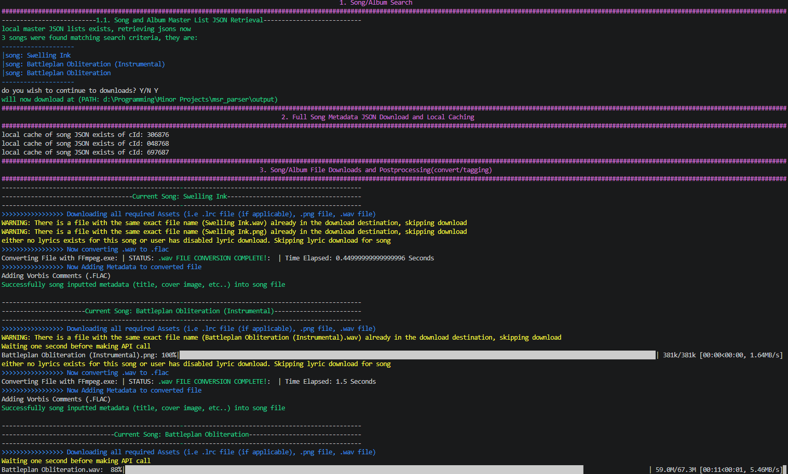

# msr-parser-CLI

  <h1 align="center">MSR Parser Python CLI</h3>
   <h3 align="center">Version: V0.1</h3>

  

     Simple Python based CLI tool for downloading and auto tagging song content from  <a href="(https://monster-siren.hypergryph.com)">Hypergryph's Official Music Website</a>.
     
    <a href="https://github.com/TBA/TBA/tree/main/_Documentation"><strong>See User Manual »</strong></a>
     
  

  
Table of Contents

  <ol>
    <li><a href="#overview">Overview</a> </li>
    <li><a href="#telemetry">Telemetry</a> </li>
	<li><a href="#built-with">Built With</a></li>
    <li><a href="#getting-started-development">Getting Started (Development)</a></li>
    <li><a href="#documentation">Documentation</a></li>
    <li><a href="#license">License</a></li>
    <li><a href="#attributions-and-acknowledgements">Attributions and Acknowledgments</a></li>
  </ol>

# Overview

Preview - Version V1.0 - 2026-05-08

# Usage

This is a Command Line Interface (CLI) Program. To use simply download the CLI from the releases tab of this page, extract, and follow the below:

### Run program from Terminal

1. Open current folder where .exe is located your terminal
2. Run with ./(program name) (song/album name/cid) 

notes: 
- if your input name is composed of only numbers, then program will search song via their content id, else it will do the normal search by name -> cid -> download URLs (can be helpful if the song/album has non english characters in it's name)

### Run program by executing it

# Built With

note: tried to use as little external libraries as possible, may use typer or click in the future to make the CLI look better 

### Python Webserver Sub Process Tech Stack
*  - Python Standalone Binary Builder
	*  - Web Server Library
	*   - Web Server Library

### Languages
* ) 

(<a href="#readme-top">back to top</a>)

# Getting Started (Development)

Just fork the git repo and pip install requirements.txt or smth idk. Not much else to work on for this thing anyways. 

(<a href="#readme-top">back to top</a>)

# Documentation
(TBD)

This project uses [Obsidian](https://obsidian.md) for Markdown file editing. Most documentation for this project is included with the "\_Documentation" folder. Documentation is either in Markdown for text or Draw.io files for diagrams (can be downloaded and imported into Draw.io to read or directly opened in VSCode using extensions). Note that documentation may not always be up to date. All documentation can be found in the \_Documentation folder in this repo.

(<a href="#readme-top">back to top</a>)

# License
N/A

(<a href="#readme-top">back to top</a>)

# Attributions And Acknowledgements

## Attributions

### Images

