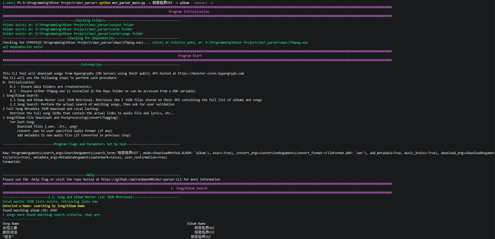
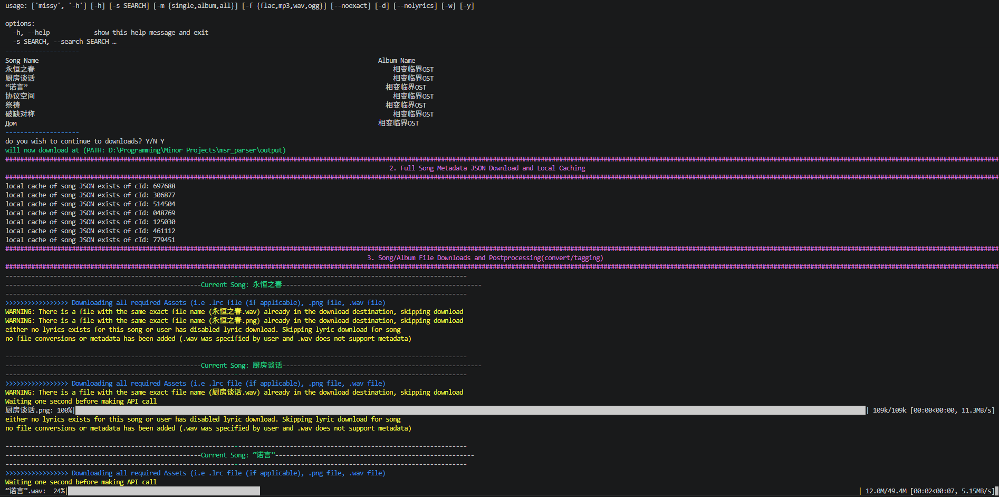
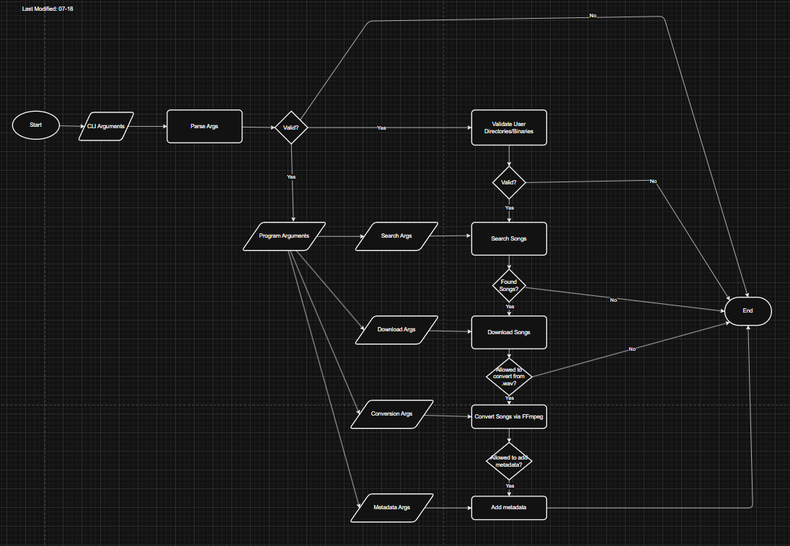
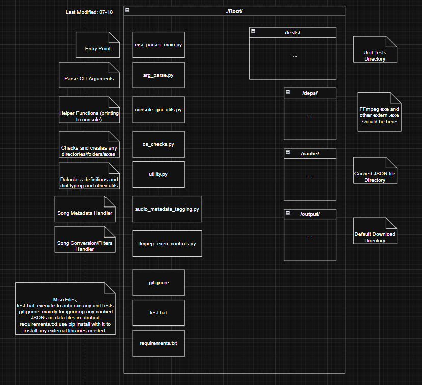
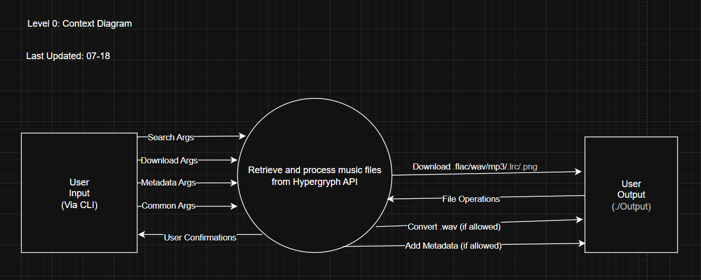
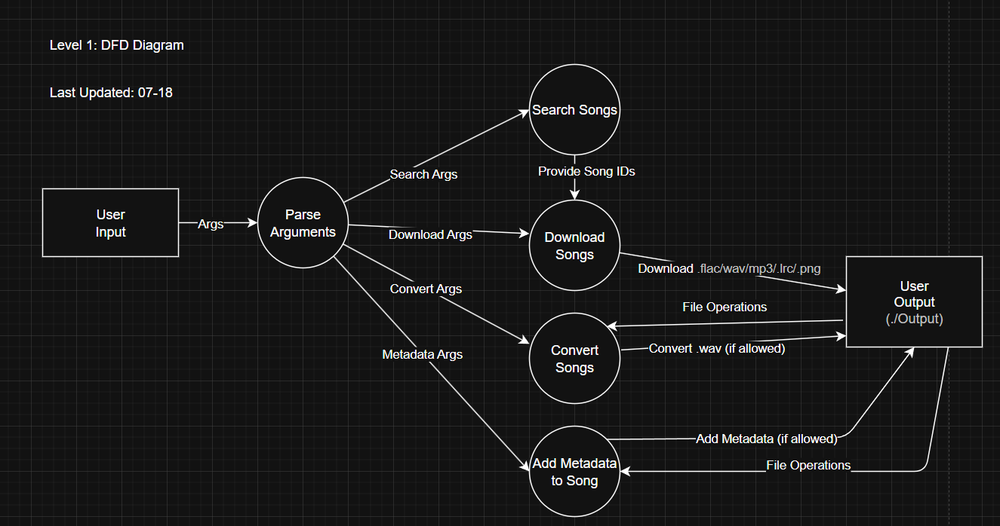

# msr-parser-CLI

  <h1 align="center">MSR Parser Python CLI (any maybe) GUI</h3>
   <h3 align="center">Version: Pre-V1.0 or smth</h3>

  

    Python based CLI tool (Later with simple GUI as well maybe) for downloading and auto tagging song content from  <a href="(https://monster-siren.hypergryph.com)">Hypergryph's Official Music Website</a>.
     
    <a href="https://github.com/TBA/TBA/tree/main/_Documentation"><strong>See User Manual (None right Now)»</strong></a>
     
  

  
Table of Contents

  <ol>
    <li><a href="#overview">Overview</a> </li>
    <li><a href="#telemetry">Telemetry</a> </li>
	<li><a href="#built-with">Built With</a></li>
    <li><a href="#getting-started-development">Getting Started (Development)</a></li>
    <li><a href="#documentation">Documentation</a></li>
    <li><a href="#license">License</a></li>
    <li><a href="#attributions-and-acknowledgements">Attributions and Acknowledgments</a></li>
  </ol>

# Overview

Preview 

Preview With sample Album Download

Python CLI for downloading songs from Arknights Soundtrack. Extremely overkill but I kind of wanted to write unit tests in Python and make an actual CLI tool for fun. 

# Requirements

### If running straight from the .py file
- Install required python deps from the requirements.txt
- Add FFmpeg.exe to deps folder
- Run the CLI in terminal with Python msr_parser_main.py {args}
TODO: add picture of this
### If running from .exe (compiled from PyInstaller)
- Add FFmpeg.exe to deps folder
- Run the exe in terminal with msr_parser_main.exe {args}
TODO: add picture of this

# Usage

Run the thing from command line from a terminal. Supply with [Arguments](https://cs.stanford.edu/people/nick/py/python-main.html) (google if you don't know how idk). Il add a GUI that wraps around the CLI if i get bored or smth.

### Possible Flags and Arguments 

NOTE: 
- -s {search term} or --search {search term} MUST be provided.
- Some arguments have no effect depending on other arguments (i.e --skiptags won't do anything for .wav files since those files don't support metadata tagging to being with)

Below are the supported/planned flags and arguments (all are optional except the search term one) that can be set before program is run. They have been split into multiple categories depending on which part of the pipeline they affect

### Common Args

| Argument                 | Options | Behaviour                                                                                            | Default Behaviour if not used                           | Implemented                  |
| ------------------------ | ------- | ---------------------------------------------------------------------------------------------------- | ------------------------------------------------------- | ---------------------------- |
| -y --skipuser            |         | Will skip user confirmation after presenting found songs to user (and any other user input).         | require user confirmations                              | <ul><li>- [x]</li>  </ul> |
| --output {"folder_path"} |         | Changes output directory of downloaded files. NOTE, if -m diff is used, this must always be provided | built in output folder used by application ("./output") |                              |

### Search Args
| Argument     | Options           | Behaviour                                                                                   | Default Behaviour if not used                                                   | Implemented                                                        |
| ------------ | ----------------- | ------------------------------------------------------------------------------------------- | ------------------------------------------------------------------------------- | ------------------------------------------------------------------ |
| -s --search  |                   | The Search Term                                                                             | no default, MUST BE PROVIDED (Literally the only Mandatory Argument in program) | <ul><li>- [x]</li>  </ul>                                       |
| --noexact    |                   | If flag is enabled, will search using the provided search term as a **substring**           | will search and match songs ONLY if exact match                                 | <ul><li>- [x]</li>  </ul>                                       |
| -m {options} | single/ album/all | Searches AND downloads either using Album name/cID or Song name/cID, or downloads all songs | Search and Downloads by single song                                             |   <ul><li>- [x] single </li>  <li>- [x] album</li>  </ul> |
| -d --diff    |                   | From found songs, only download those that don't exist in output directory.                 |                                                                                 |                                                                    |

### Download Args
| Argument   | Options | Behaviour                                                               | Default Behaviour if not used                  | Implemented                  |
| ---------- | ------- | ----------------------------------------------------------------------- | ---------------------------------------------- | ---------------------------- |
| --nolyrics |         | Will skip downloading any .lrc files if a song has it                   | Downloads .lrc files                           | <ul><li>- [x]</li>  </ul> |
| -a         |         | Will download songs into separate album folders in the output directory | Downloads all songs ungrouped output directory |                              |

### Conversion Args

| Argument              | Options         | Behaviour                                                                                                                                   | Default Behaviour if not used | Implemented                  |
| --------------------- | --------------- | ------------------------------------------------------------------------------------------------------------------------------------------- | ----------------------------- | ---------------------------- |
| --filter {options}    | normalize/strip | all done using FFmpeg filters: - normalize: normalize audio - strip: remove beginning and end portions of silence if song has any  | No Filters applied            |                              |
| -f --format {options} | mp3/flac/ogg    | Will convert downloaded music files to the following format                                                                                 | no conversions                | <ul><li>- [x]</li>  </ul> |

### Metadata Args

| Argument             | Options Avaliable | Behaviour                                                                                                                  | Default Behaviour if not used                                | Implemented                  |
| -------------------- | ----------------- | -------------------------------------------------------------------------------------------------------------------------- | ------------------------------------------------------------ | ---------------------------- |
| --metadata {options} | none,basic,full   | none: does not add metadata basic: adds metadata provided from the Hypergryph API only full: IDK about this one ngl  | adds metadata tags to converted song files with "basic" mode |                              |
| --musicbrainz        |                   | Will use the MusicBrainz API to add any missing metadata to songs                                                          | no musicbrainz metadata used                                 |                              |
| -v                   | --waveform        | create a .png showing waveform of song                                                                                     | No visualization                                             |                              |
| -a                   | --ass             | using audio source separation, create multiple audio files containing distinct audio elements (i.e guitars, vocals, etc..) | None                                                         |                              |
| -w --watermark       |                   | Watermark in song metadata comments field with this github link                                                            | Defaults to no watermark                                     | <ul><li>- [x]</li>  </ul> |

### Examples:

# Built With

- Note: any built in python libraries not shown here
- We note that Github Workflow scripts will be/are used to build the binaries and perform automated testing 
### Python Stack (External Libraries)
*  - Python Standalone Binary Builder
*   - Audio File Metadata Library
*   - HTTP Library
-   - Console Progress Bar Library

### Languages
*  - Self Explanatory

### External Binaries
-   - Video/Audio Processing Library/Executable 

- Note: I've tried to use as little external libraries and tools as possible. The ones that are included are because implementing their functionality would take an too long or are vastly out of scope for this project.

(<a href="#readme-top">back to top</a>)

# Getting Started (Development)

### Overview
Project uses a pipelined workflow as seen below:

*General Program Execution Flow.*

Arguments are passed in from user via CLI arguments, these are parsed using the built in ArgParse python library and then mapped to multiple data classes contained in a master data class. 5 steps are then taken:

1. *Validation of any folder directories*
	- Also checks if FFmpeg is installed in /deps/ or can be accessed in ENV
2. *Search songs using provided search arguments*
3. If user accepts the search (or auto user confirmation is enabled)
	1. *Download found songs*
	2. If Allowed to convert songs
		1. *Convert songs via FFmpeg*
		2. If allowed to add metadata
			1. *Add metadata*

### Project Structure
Current project folder organization. I am aware i should probably put the actual program script files in its own separate folder as well as separating any  

*Descriptions and current project structure*

### Data Flow
I don't know why i made these ngl (I don't even know if these are correct, forgot most of COE691)

*Level 0 Context Diagram*

*Level 1 Data Flow Diagram*

### Testing
I have some unit tests done but Im lazy asf.

### Contributions
Just fork the git repo and pip install requirements.txt or smth idk. Not much else to work on for this thing anyways as it should fit most of my personal requirements. 

(<a href="#readme-top">back to top</a>)

# Documentation

This project uses [Obsidian](https://obsidian.md) for Markdown file editing. Most documentation for this project is included with the "\_Documentation" folder. Documentation is either in Markdown for text or Draw.io files for diagrams (can be downloaded and imported into Draw.io to read or directly opened in VSCode using extensions). Note that documentation may not always be up to date. All documentation can be found in the \_Documentation folder in this repo.

(<a href="#readme-top">back to top</a>)

# License

(<a href="#readme-top">back to top</a>)

# Disclaimer and Acknowledgements

### Acknowledgements
- Thanks to Hypergryph for actually providing said API as well the means to download high quality audio files direct from source instead of being forced to stream the music from Spotify or other means

### Disclaimer
Songs retrieved from this software is obviously owned by Hypergryph Co. Ltd., as a content retrieval API is publicly exposed and other GitHub hosted downloading scripts exists i am assuming that retrieving and downloading these songs are allowed as longs as its not done commercially.

